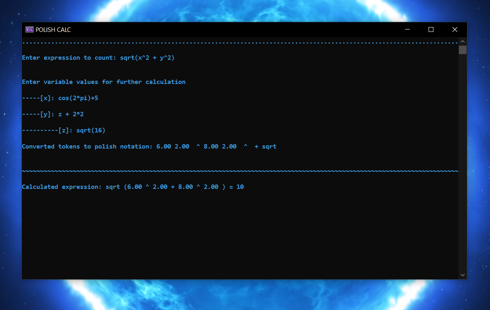

# Polish Calc

Simple calculator using polish notation and data structures (stack and queue) with support for user-defined variables as the univercuty lab

The program was written on clearly C. Math functions realized by adding math.h libruary. 

## Explaination

### Main idea

Expression counting takes place in 4 steps (5 with variables)
1) Tokenizing an expression for further processing 
2) Checking the entered expression for correctness, absence of errors
3) Converting an expression to polish notation 
4) Calculation main expression (if expression without variables)
5) Calculation of entered variables for further calculation of the main expression 

### First step - Tokenization

In order to immediately recognize what we are working with, we decided to tokenize the whole mathematical expression including brackets

All further interactions will be performed with special objects - tokens, which store type of token, math function (if type is function), value (double) and character which stores operator or variable letter
I know I could have used the union to save memory, but i doesnt do that XD

Full structure of token store in file structures.h.

Tokens are used in each subsequent action in the program, starting with checking the entered expression and ending with a function for calculation
#### How works tokenizer?
So, the main idea of tokenizer it's to parse some char string to array with tokens. The main loop parsing one character for one iteration. The main loop of the program goes through the entire string one element at a time. 
There are two main flags in the function for proper processing of incoming characters:
1) ParsingNumberRN
If this ParsingNumberRN is 1, it tells us that we are currently processing a number. All read characters (including dots) go into a temporary buffer (TempCharLine) for further conversion to double
When the characters run out, the convertStringToDouble function converts the accumulated string to the double data type, and a new separate token with that value and value type is added. After adding new token, the buffer (TempCharLine) is cleared and the flag becomes zero
2) ParsingFunctionRN
When this flag is 1, it means that we are currently trying to identify a math function. If we encounter a single letter, it means that we are looking at a variable whose value will be asked of the user. But if there's another letter after that letter, that means we're parsing some kind of function.
To define a function, we check with each iteration whether the combination of letters we have collected matches known mathematical functions. If there is a match, we add a token with the function type and assign the values of the recognized function to it. If the string matches the string "pi", we assign the value 3.14 to the token.
In the case when there is no match and the stream of letters has come to the end, we assign a type to the token ERROR 

After executing this function, we get the finished tokenized expression as an array of tokens

### Second step - checking correctness

I write three funcrions that checks does input is correct
1) CheckBrackets()
	This functions checking brackets positions, it works with stack. 
1) CheckInput()
   This function is pretty simple function that checks does every character in the Whitelist (" 1234567890+-^*!/()abcdefghijklmnopqrstuvwxyz.,")
   WhiteList contains all summands that can be used in a mathematical expression
3) CheckTokenPosutions()
   The function checks pairwise tokens, whether there are possible cases of their combination in a mathematical expression
   It checks if there is a parenthesis after the function, the existence of repeated consecutive operators (excluding brackets) and containing of token with error value
   
### Third step - Converting to polish notation 

This function ConvertToPolishs() converts an infix expression, represented as an array of tokens, into a reverse Polish notation (postfix form) using the stack. Description of how it works:

1. Initialization:
   - Creating a new stack and initializing it.
   - Creating a new queue and initializing it.
2. Token processing:
   - A while loop is started, which will be executed until the end of the token array is reached (tokens[i].type != END).
   - For each token:
     - If the token is a number or variable (VALUE or VARIABLE), it is added to the queue.
     - If the token is an opening parenthesis (BRACKET_OPEN), it is placed on the stack.
     - If the token is a closing bracket (BRACKET_CLOSE), all tokens up to the first opening bracket are removed from the stack and added to the queue, which is also removed from the stack but not added to the queue.
3. Functions:
   - If there is a function (FUNCTION) at the top of the stack and there is no opening bracket before it, the function is added to the queue immediately after its last argument.
   - If the current token is an operator (OPERAND):
     - The priority of the current operator compared to the operator at the top of the stack is checked.
     - If the priority of the current operator is less than or equal to the operator at the top of the stack, the operator is removed from the stack and added to the queue.
     - The current operator is placed on the stack.
   - If the token is a function, it is placed on the stack.

4. After all tokens have been processed:
   - All remaining operators are extracted from the stack and added to the queue.

Thus we obtain a queue with our mathematical expression in Polish notation

### Fourth step - Calculating

The OperatorCalculation() function accepts three tokens: two values (val1 and val2) and an operator (oper). It performs the arithmetic operation specified in the operator token on the two values and returns the result in a new token:

   - If oper is plus (+), it returns the sum of the values.
   - If minus (-), it returns the difference.
   - If multiplication (*), it returns the product.
   - If division (/), it checks that the divisor is not zero, and returns the quotient or an error if the divisor is zero.
   - If raising to a power (^), returns the result of raising the first value to the power of the second value.
   - If the operation fails, the function returns a token with the error type (__ERROR).

The calculate() function uses the token queue, which must already be in the form of a reverse polish entry, and the stack to calculate the expression:

   - The stack is initialized.
   - Next, tokens are fetched from the queue until the end (END) token is processed.
   - For each token, its type is checked:
     - If the token is a value (VALUE), it is placed at the top of the stack.
     - If the token is an operand (OPERAND), the top two values are extracted from the stack, which are then operated on according to the resulting operand using the OperatorCalculation function.
     - If the result of the operation is not an error, it is placed back on the stack; if the operation fails (e.g., division by zero), the program terminates with an error.
     - If the token is a function (FUNCTION), some specific function (e.g., factorial or other math function) is executed that is not reported in the provided code. If successful, the result is added to the stack, and if an error occurs, the program also terminates with an error.
   - The process is repeated until the queue runs out of tokens.
   - At the end of the operation, the stack should contain one value, which is the result of the entire expression computation. This value is extracted from the stack and the stack is freed.
   - The calculate function returns the result of the calculation as a double.

### Fifth step (if variables have been entered) - Calculation of entered variables

The DefineNewVariable function walks through the token array and defines the variables entered by the user. Here's how it works:

1. The function starts finding tokens of type VARIABLE in the token array array, traversing it from the beginning until it encounters the END token, which signals the end of the array.
2. If the token is a variable (VARIABLE), the function checks if the variable is known using the IsPreviouslyKnownVariable function. If the variable is known, its value is retrieved from the KnownVars array using the index obtained by the GetIndexLetter function. After that, the variable token is converted to the VALUE type and the retrieved value is written into it.
3. If the variable is unknown, the function increments the TabsCounter variable by 5 to create an indentation in the text interface.
4. Outputs hyphens according to TabsCounter and prompts the user to enter a value for the new variable, using the variable symbol for a hint.
5. Using the scanf function, reads the string entered by the user and passes it to the tokenizer function, creating a new token array newtokens.
6. If a new variable was found in the entered expression, the function recursively calls itself for new tokens via DefineNewVariable(newtokens).
7. Decreases TabsCounter back to 5 after processing the variable, removing indentation in the text interface.
8. It then calls ConvertToPolishs, passing an array of newtokens and their length to get the token queue in Polish notation.
9. The calculate function is then used to calculate the value of the expression represented in Polish notation.
10. The resulting value is stored in the KnownVars array at the position corresponding to that variable, and also writes the VALUE value type and the value itself to the token array with the token type changed from VARIABLE to VALUE.
11. The KnownVarsPositions array changes the status of the variable to known (set to 1).
12. At the end, the function frees the memory allocated for newtokens.

The DefineNewVariable function plays a key role in identifying and defining variables entered by the user and in preparing these variables for expression evaluation. It provides an interactive user interface, displays error messages, and handles variable recursion.
### How data structures work?
   
#### Stack and Queue

Expression counting is optimized through the use of data structures (queue and stack)
Queue and stack are the linear list data structures.
All these data structures in file structures.c

##### How does queue and stack works? 

1) Stack
   The stack data structure is a linear data structure
   Simply put, a stack is like a plate of pancakes. Only the last pancake cooked can be eaten, we can't take a pancake from the bottom or from the middle
   
2) Queue
   A queue is a linear data structure that stores the elements sequentially in the queue
   For example, imagine a queue in the supermarket. Angry grannies won't allow you stand at the front of the queue, you can to join queue only to rear side
   

##### How works lenear linked lists?
Linear data structure where elements are not stored at contiguous location, instead the elements are linked using pointers. In a linked list data is stored in nodes and each node is linked to the next and, optionally, to the previous

1) Singly linked lists. 
   Every element - Node has value (in our case Token) and pointer to next elenebt of list. We can go back, we can only see what is in the previous element by going through all the elements of the linear list first 
   
   In this case, singly linked list using in queue
   
2) Doubly linked lists.
   Every node has two pointers: to next element and to previous element. 
   
    In this case, double linked list using in stack
   
All these data stuctures you can find in structures.c and structures.h

## How to run

To compile and run the build, the easiest way is to add the source files in visual studio and compile them.
Just add .c files to source files folder and .h files to headers and run (ctrl + f5)

